# System Architecture

Rift Companion uses a dual-process architecture separating a high-performance Rust backend from a lightweight, reactive Svelte 5 webview frontend.

```mermaid
sequenceDiagram
    participant League Client (LCU)
    participant Rust Background Task
    participant Tauri Core & Commands
    participant Svelte Store & Webview

    Note over Rust Background Task: runs run_watcher() in tokio thread
    Note over Svelte Store & Webview: initIpc() binds listeners
    
    rect rgb(30, 41, 59)
        Note over League Client (LCU), Svelte Store & Webview: Connection Discover & Priming
        Rust Background Task->>League Client (LCU): Poll lockfile
        League Client (LCU)-->>Rust Background Task: Lockfile found (Port, Token)
        Rust Background Task->>Tauri Core & Commands: Set ConnectionStatus::Connected
        Tauri Core & Commands-->>Svelte Store & Webview: Emit "lcu://connection" -> Connected
        Svelte Store & Webview->>Tauri Core & Commands: Invoke get_draft_state & get_recommendations
        Tauri Core & Commands-->>Svelte Store & Webview: Returns current cached states (if mid-draft)
    end

    rect rgb(15, 23, 42)
        Note over League Client (LCU), Svelte Store & Webview: Live Draft Event Loop
        League Client (LCU)->>Rust Background Task: WebSocket event payload (/lol-champ-select/v1/session)
        Rust Background Task->>Rust Background Task: Normalize draft session via draft::from_session()
        Rust Background Task->>Rust Background Task: Run engine::recommend() scoring over active repository
        Rust Background Task->>Tauri Core & Commands: Cache draft & recommendation vectors in Shared state
        Tauri Core & Commands-->>Svelte Store & Webview: Emit "champ-select://update" (DraftState)
        Tauri Core & Commands-->>Svelte Store & Webview: Emit "recommendations://update" (Vec<Recommendation>)
        Note over Svelte Store & Webview: Re-render DraftBoard & RecommendationList
    end
```



## Core Components

The architecture spans across three runtime environments:

1. **The League Client (LCU)**
   * Provides authentication secrets on disk via a `.lockfile` file in the League folder.
   * Exposes a self-signed HTTPS server and a secure WebSocket channel.
   * Emits live game selection updates on the topic `OnJsonApiEvent_lol-champ-select_v1_session`.

2. **The Tauri Rust Backend ([src-tauri/src/lib.rs](../src-tauri/src/lib.rs))**
   * **State Cache ([Shared](../src-tauri/src/lib.rs#L34-L41))**: Holds thread-safe reference-counted mutexes for:
     * Active champion stats repository (`repo`).
     * Algorithm calculation weights (`weights`).
     * Most recent normalized state of the draft (`latest_draft`).
     * Current client connection status (`connection`).
   * **LCU Watcher ([lcu::run_watcher](../src-tauri/src/lcu/mod.rs#L18))**: A background `tokio` thread checking lockfile existence, executing REST/WebSocket channels, and updating connection status.
   * **Data Refresher ([opgg::refresh::run_refresher](../src-tauri/src/opgg/refresh.rs#L27))**: Periodically crawls OP.GG to update stats on patch change.
   * **Command IPC Handlers ([commands.rs](../src-tauri/src/commands.rs))**: Exposes state variables to the frontend and processes Live Weight adjustments via Tauri invoke commands.

3. **The Svelte Webview Frontend ([src/App.svelte](../src/App.svelte))**
   * **Stores ([src/lib/stores](../src/lib/stores))**: Tracks draft, connections, UI window state, and recommendations reactive variables.
   * **IPC Manager ([src/lib/ipc/tauri.ts](../src/lib/ipc/tauri.ts))**: Listens to backend-emitted events and binds them to Svelte stores. Performs priming on boot.

4. **The NAS Data Server ([server/](../server/README.md))**
   * A containerized Docker microservice running 24/7 on a local NAS or home server.
   * Periodically pre-crawls all 7 cumulative Plus rank tiers (`iron_plus`, `bronze_plus`, `silver_plus`, `gold_plus`, `platinum_plus`, `emerald_plus`, `diamond_plus`) from OP.GG and Data Dragon.
   * Synthesizes lower-tier plus ranks (`silver_plus`, `bronze_plus`) via exact weighted aggregation to ensure high statistical power.
   * Hosts an interactive Web Dashboard (`http://<host>:8085`) providing live crawler progress, database exploration, manual refresh triggers, and health checks.
   * Exposes REST endpoints (`/api/stats`, `/api/status`, `/api/refresh`, `/api/champions`) allowing the desktop client to load champion datasets directly into RAM in milliseconds without local disk dumps.

## State Distribution Flow

```
   [LCU WebSocket Frame] 
            │
            ▼
    [lcu::run_watcher] -> normalizes payload to -> [draft::DraftState]
            │
            ├───────────────────────────────────────────────────────┐
            ▼                                                       ▼
   [engine::recommend]                                     Cache DraftState
            │                                                       │
            ▼                                                       ▼
   Emit "recommendations://update"                         Emit "champ-select://update"
            │                                                       │
            ▼                                                       ▼
   [svelte::recommendations store]                         [svelte::draft store]
            │                                                       │
            ▼                                                       ▼
   Updates <RecommendationList />                          Updates <DraftBoard />
```

### Remote Data Sync Flow (NAS Server Mode)

```
   [SettingsModal: server_url configured]
            │
            ▼
   [opgg::remote::fetch_remote_stats] ──(HTTP GET /api/stats?tier=...)──> [Rift Server (NAS Docker)]
            │                                                                      │
            │ <─────────── Returns Gzip-compressed JSON dataset ───────────────────┘
            ▼
   Parse into memory ([data::repository::Repository])
            │
            ├─► Updates Shared pointer in RAM (Zero local disk writes)
            └─► Triggers immediate draft recalculation & recommendation update
```
